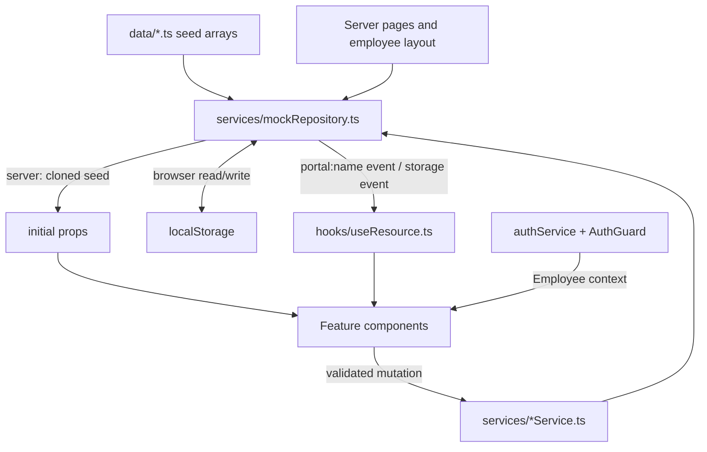

# Architecture

## Runtime and component hierarchy

[app/layout.tsx](../app/layout.tsx) supplies Persian RTL HTML, local font loading, metadata, `dynamic = "force-dynamic"`, and the root `ToastProvider`. Pages are thin App Router wrappers, mostly delegating to client feature components.

```text
RootLayout / ToastProvider
├─ /login or /admin/login → LoginForm
├─ EmployeeLayout → AuthGuard → PortalShell
│  ├─ employee page component
│  └─ InfoRail → Calendar, Clock, news ticker, gallery
└─ AdminLayout → AuthGuard(admin) → PortalShell(admin)
   └─ admin page component
```

Layout sources: [employee layout](<../app/(employee)/layout.tsx>), [admin layout](<../app/admin/(panel)/layout.tsx>). Both use the same [AuthGuard](../components/shared/AuthGuard.tsx) and [PortalShell](../components/shared/PortalShell.tsx); only the employee group supplies the information rail. Shared CSS and UI primitives establish both panels' appearance.

There is no domain backend in this repository. Server components read seed data because the repository adapter cannot access browser storage on the server. The client guard resolves an identity after mount before rendering its children. Initial service calls in server wrappers are therefore **not server-side authorization**.

## Data and communication



[Repository<T>](../types/index.ts) standardizes async list/get/create/update/remove/replace and subscription methods. Services create stable module-level repository instances. [useResource](../hooks/useResource.ts) owns each consumer's data/loading/error state; there is no centralized application store or external query cache. Browser writes dispatch an in-tab event, and other same-origin tabs receive native storage events. See [STATE_MANAGEMENT.md](STATE_MANAGEMENT.md) for exact lifecycle and keys.

Components do not import seed arrays directly. Pages use service aliases such as `getNews`; client features call repository methods and optional domain helpers. `useEmployee` supplies identity, `useToast` supplies transient messages, and `next/link`/`next/navigation` supply navigation. Filters, pagination, form drafts, and modal visibility belong to the component that renders them.

## Existing implementation patterns

- **Thin route wrapper / client feature:** `app/` handles parameters, metadata, and occasional initial reads. Behavior belongs in `components/` and `services/`.
- **Configured content CRUD:** [ContentManager.tsx](../components/admin/ContentManager.tsx) selects typed [resourceConfig.tsx](../components/admin/resourceConfig.tsx) configurations. News/courses use route editors; gallery/announcements/quick processes use modal editors. Shared tables, forms, previews, and delete confirmations handle common UI.
- **Dedicated domain forms:** accounts, feedback, process requests, tickets, and nested phone extensions retain their specialized components and validation. Do not force them into the content configuration contract just to reduce file count.
- **Read filtering at the feature:** published/active content and `employeeId` ownership are filtered by consumers, not enforced by repositories.
- **Stable IDs:** repositories generate IDs with `crypto.randomUUID()`. Renaming an account retains its ID, preserving own feedback/tickets/processes. Activity ownership is an exception: some activity filtering compares a display name.
- **Explicit error surfaces:** service errors are thrown as `Error`; `errorMessage` converts unknown failures for form alerts, error states, or toasts. There is no centralized error reporting service.
- **Gregorian storage, Persian presentation:** ISO timestamps/date strings are formatted with the Persian calendar and Tehran time zone. Native date fields accept Gregorian dates.

## Cross-feature dependencies and change impact

| Change | Dependencies and affected consumers |
| --- | --- |
| Employee account shape or validation | `AdminEmployees → saveEmployee → employeeService`; `LoginForm → authService → AuthGuard → useEmployee` throughout the employee panel |
| Employee identity / ID | Process, ticket, feedback ownership; course enrollment deduplication; dashboard counts; profile display |
| News publication | Admin content manager → news repository → employee list/detail, dashboard, every employee information rail, admin overview |
| Course enrollment | CoursesPage → process repository → inbox/details/dashboard; activity repository → histories |
| Directory edits | AdminPhoneDirectory → department/extension repository → employee directory and ticket department selection; no account synchronization |
| Quick links | Admin content manager (`kind="processes"`) → quick-process repository → dashboard QuickProcesses; separate from process records |
| Shared storage adapter/hook | All collections, server seeds, error states, persistence, same-tab/cross-tab refresh |
| Shared shell, CSS, primitives, modal or table | Both panels and many routes; include responsive and keyboard checks |

Full file-level edges are in [FEATURE_MAP.md](FEATURE_MAP.md).

## Important limits and existing debt

Repository operations have no network calls, permissions, schema migrations, transactions, or conflict resolution. Entire arrays are replaced on write, so concurrent tab writes can overwrite each other. Runtime storage checks validate only array entries' string IDs, not full models.

Creating a process awaits the activity write after the process has already been saved: an activity failure can leave a successful process with an error UI. Content edits and course enrollment log activity separately with a warning on failure. Deleting employees does not cascade to their data or immediately refresh a mounted guard. Deleting courses does not remove enrollment processes. These are current behaviors, not guarantees of transactional consistency.

`ResourceConfig.viewHref` exists and news supplies it, but `ContentManager` does not consume it. Several async `get*` aliases are available without being used by current pages. Preserve contracts unless the requested change makes their removal necessary. Real integration contracts are **NOT CURRENTLY IMPLEMENTED**; comments about future API replacement do not define endpoints.
